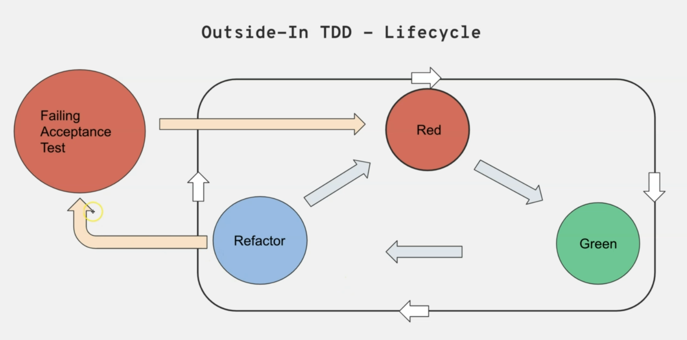
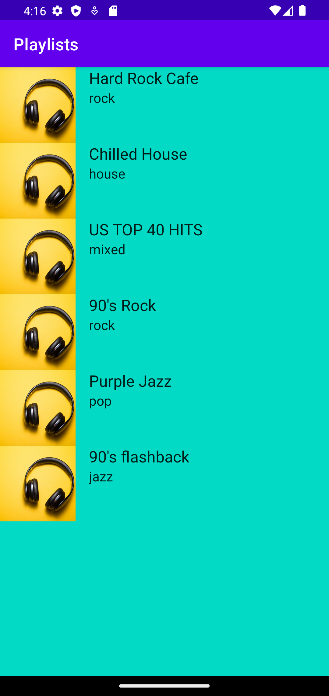

# MusicApp 🎵

An Android music playlist application built with Kotlin, following Test-Driven Development (TDD) principles and modern Android development best practices.

## 📋 Table of Contents

- [Overview](#overview)
- [Features](#features)
- [Architecture](#architecture)
- [Technologies & Libraries](#technologies--libraries)
- [Prerequisites](#prerequisites)
- [Setup & Installation](#setup--installation)
- [Running the Application](#running-the-application)
- [Testing](#testing)
- [Project Structure](#project-structure)
- [API Setup](#api-setup)
- [Screenshots](#screenshots)
- [Contributing](#contributing)

## 📖 Overview

MusicApp is a demonstration Android application that showcases best practices in modern Android development. The app displays a list of music playlists fetched from a REST API, categorized by music genres such as Rock, Jazz, House, Pop, Electro, and Mixed.

The project emphasizes:
- **Test-Driven Development (TDD)** - Comprehensive unit and instrumentation tests
- **Clean Architecture** - MVP (Model-View-Presenter) pattern
- **Dependency Injection** - Using Dagger Hilt
- **Reactive Programming** - Kotlin Coroutines and LiveData
- **Modern Android UI** - ViewBinding and RecyclerView

## ✨ Features

- Display music playlists from a REST API
- Categorized playlists (Rock, Jazz, House, Pop, Electro, Mixed)
- Smooth scrolling playlist interface
- Offline data handling
- Comprehensive error handling
- Unit and instrumentation testing

## 🏗️ Architecture

This application follows the **MVP (Model-View-Presenter)** architectural pattern with the following components:

### Layers:

1. **View Layer** (`PlaylistFragment`)
   - Displays the UI
   - Handles user interactions
   - Observes ViewModel LiveData

2. **ViewModel Layer** (`PlaylistViewModel`)
   - Manages UI-related data
   - Survives configuration changes
   - Communicates with Repository

3. **Repository Layer** (`PlaylistRepository`)
   - Single source of truth for data
   - Abstracts data sources
   - Manages data operations

4. **Service Layer** (`PlaylistService`, `PlaylistAPI`)
   - Handles network requests
   - Retrofit API interfaces
   - Data transformation

### Data Flow:
```
View ← → ViewModel ← → Repository ← → Service ← → API
```

## 🛠️ Technologies & Libraries

### Core Technologies
- **Language**: Kotlin 1.7.20
- **Min SDK**: 29 (Android 10)
- **Target SDK**: 33 (Android 13)
- **Compile SDK**: 33
- **Build Tool**: Gradle 7.3.0

### Key Libraries

#### Android Core
- AndroidX Core KTX 1.9.0
- AppCompat 1.5.1
- Material Components 1.6.1
- ConstraintLayout 2.1.4
- RecyclerView 1.2.1

#### Architecture Components
- Lifecycle ViewModel KTX 2.6.0
- Lifecycle LiveData KTX 2.5.1
- ViewBinding

#### Dependency Injection
- Dagger Hilt 2.44
- Hilt Android Compiler 2.44

#### Networking
- Retrofit 2.9.0
- Gson Converter 2.9.0

#### Asynchronous Programming
- Kotlin Coroutines Core 1.6.4
- Kotlin Coroutines Android 1.6.4

#### Testing Libraries

**Unit Testing:**
- JUnit 4.13.2
- Mockito Kotlin 2.2.0
- Mockito Inline 4.3.1
- Core Testing 2.1.0
- Coroutines Test 1.6.4

**Instrumentation Testing:**
- AndroidX Test 1.4.0
- Espresso Core 3.4.0
- Espresso Contrib 3.4.0
- Espresso Intents 3.4.0
- Barista 4.2.0
- OkHttp3 Idling Resource 1.0.0

## 📋 Prerequisites

Before you begin, ensure you have the following installed:

- **Android Studio**: Arctic Fox or newer (recommended: latest stable version)
- **JDK**: Java Development Kit 8 or higher
- **Android SDK**: API Level 29 or higher
- **Gradle**: 7.3.0 or higher (bundled with Android Studio)
- **Mockoon**: For running the mock API server ([Download Mockoon](https://mockoon.com/))

## 🚀 Setup & Installation

### 1. Clone the Repository

```bash
git clone <repository-url>
cd MusicApp
```

### 2. Open in Android Studio

1. Launch Android Studio
2. Select "Open an Existing Project"
3. Navigate to the cloned MusicApp directory
4. Click "OK"

### 3. Sync Project

Android Studio will automatically prompt you to sync the Gradle files. If not:
1. Click on "File" → "Sync Project with Gradle Files"
2. Wait for the sync to complete

### 4. Configure the Mock API Server

See [API Setup](#api-setup) section below for detailed instructions.

## 🎮 Running the Application

### Method 1: Using Android Studio

1. Connect an Android device via USB (with USB debugging enabled) or start an Android Emulator
2. Ensure your device/emulator is running Android 10 (API 29) or higher
3. Select your device from the device dropdown
4. Click the "Run" button (▶️) or press `Shift + F10`

### Method 2: Using Gradle

```bash
# Build the project
./gradlew build

# Install on connected device
./gradlew installDebug

# Run the app
adb shell am start -n com.paulyaro.mymusicapp/.MainActivity
```

## 🧪 Testing

The project includes comprehensive test coverage with both unit tests and instrumentation tests.

### Run Unit Tests

```bash
# Run all unit tests
./gradlew test

# Run unit tests with coverage
./gradlew testDebugUnitTest --coverage
```

**From Android Studio:**
- Right-click on the `test` directory
- Select "Run 'Tests in 'mymusicapp''"

### Run Instrumentation Tests

```bash
# Run all instrumentation tests
./gradlew connectedAndroidTest

# Run specific test class
./gradlew connectedAndroidTest -Pandroid.testInstrumentationRunnerArguments.class=com.paulyaro.mymusicapp.PlayListFeature
```

**From Android Studio:**
- Right-click on the `androidTest` directory
- Select "Run 'All Tests'"

### Test Classes

**Unit Tests:**
- `PlaylistViewModelShould` - ViewModel unit tests
- `PlaylistRepositoryShould` - Repository unit tests
- `PlaylistServiceShould` - Service layer unit tests

**Instrumentation Tests:**
- `PlayListFeature` - End-to-end feature tests
- `ExampleInstrumentedTest` - Basic instrumentation tests

### View Test Coverage



## 📁 Project Structure

```
MusicApp/
├── app/
│   ├── src/
│   │   ├── main/
│   │   │   ├── java/com/paulyaro/mymusicapp/
│   │   │   │   ├── MainActivity.kt
│   │   │   │   └── playlist/
│   │   │   │       ├── Playlist.kt                    # Data model
│   │   │   │       ├── PlaylistAPI.kt                 # Retrofit API interface
│   │   │   │       ├── PlaylistService.kt             # Service implementation
│   │   │   │       ├── PlaylistRepository.kt          # Data repository
│   │   │   │       ├── PlaylistViewModel.kt           # ViewModel
│   │   │   │       ├── PlaylistViewModelFactory.kt    # ViewModel factory
│   │   │   │       ├── PlaylistFragment.kt            # UI Fragment
│   │   │   │       ├── MyPlaylistRecyclerViewAdapter.kt # RecyclerView adapter
│   │   │   │       ├── PlaylistApplication.kt         # Application class
│   │   │   │       └── PlaylistModule.kt              # Hilt module
│   │   │   └── res/
│   │   │       ├── layout/                            # XML layouts
│   │   │       ├── values/                            # Resources
│   │   │       └── ...
│   │   ├── test/                                      # Unit tests
│   │   │   └── java/com/paulyaro/mymusicapp/
│   │   │       ├── utils/
│   │   │       │   ├── BaseUnitTest.kt
│   │   │       │   ├── LiveDataTestExtensions.kt
│   │   │       │   └── MainCoroutineScopeRule.kt
│   │   │       └── playlist/
│   │   │           ├── PlaylistViewModelShould.kt
│   │   │           ├── PlaylistRepositoryShould.kt
│   │   │           └── PlaylistServiceShould.kt
│   │   └── androidTest/                               # Instrumentation tests
│   │       └── java/com/paulyaro/mymusicapp/
│   │           ├── PlayListFeature.kt
│   │           └── ExampleInstrumentedTest.kt
│   └── build.gradle                                   # App-level Gradle file
├── gradle/                                            # Gradle wrapper
├── build.gradle                                       # Project-level Gradle file
├── settings.gradle                                    # Gradle settings
├── playlists.json                                     # Mock API data
├── Screenshot_playlist.png                            # App screenshot
├── TDD.PNG                                           # Test coverage screenshot
└── README.md                                         # This file
```

## 🔌 API Setup

This application uses **Mockoon** to simulate a REST API server locally.

### Setting up Mockoon

1. **Download and Install Mockoon**
   - Visit [https://mockoon.com/](https://mockoon.com/)
   - Download the version for your operating system
   - Install and launch Mockoon

2. **Create a New Environment**
   - Click "New Environment"
   - Set the server port to `3000`
   - Set the server host to `localhost`

3. **Configure the Endpoint**
   - Click "Add Route"
   - Set the route path to: `/playlists`
   - Set the HTTP method to: `GET`
   - Set the response status code to: `200`

4. **Add Response Data**
   - Copy the content from `playlists.json` file in the project root
   - Paste it into the Response body in Mockoon
   - Ensure the Content-Type header is set to `application/json`

5. **Start the Mock Server**
   - Click the "Play" button to start the server
   - The server should be running at `http://localhost:3000`

6. **Verify the Endpoint**
   - Open your browser or use curl:
   ```bash
   curl http://localhost:3000/playlists
   ```
   - You should see the JSON response with the playlist data

### API Endpoint

```
GET http://localhost:3000/playlists
```

**Response Format:**
```json
[
  {
    "id": "1",
    "name": "Hard Rock Cafe",
    "category": "rock"
  },
  {
    "id": "2",
    "name": "Chilled House",
    "category": "house"
  }
  // ... more playlists
]
```

### Available Playlists

The mock API provides 10 playlists across various categories:
- **Rock**: Hard Rock Cafe, 90's Rock
- **House**: Chilled House
- **Jazz**: Purple Jazz
- **Pop**: 90's flashback
- **Electro**: Machine Funk, Feel The Beat
- **Mixed**: US TOP 40 HITS, Let's Groove, Best Songs 2020

### Connecting Physical Device to Local Server

If testing on a physical device connected via USB:

1. Find your computer's local IP address:
   ```bash
   # On Windows
   ipconfig

   # On macOS/Linux
   ifconfig
   ```

2. Update the base URL in the app to use your local IP:
   ```
   http://<YOUR_LOCAL_IP>:3000/playlists
   ```

3. Ensure your device and computer are on the same network

## 📸 Screenshots

### Playlist View


### Test Coverage


## 🤝 Contributing

Contributions are welcome! Here's how you can contribute:

1. **Fork the repository**
2. **Create a feature branch**
   ```bash
   git checkout -b feature/amazing-feature
   ```
3. **Make your changes**
4. **Write/update tests**
5. **Commit your changes**
   ```bash
   git commit -m "Add some amazing feature"
   ```
6. **Push to the branch**
   ```bash
   git push origin feature/amazing-feature
   ```
7. **Open a Pull Request**

### Development Guidelines

- Follow Kotlin coding conventions
- Write unit tests for new features
- Ensure all tests pass before submitting PR
- Update documentation as needed
- Use meaningful commit messages

## 📄 License

This project is for educational and demonstration purposes.

## 👨‍💻 Author

Created by Paul Yaro

## 📚 Resources

- [Kotlin Documentation](https://kotlinlang.org/docs/home.html)
- [Android Developer Guides](https://developer.android.com/guide)
- [Dagger Hilt Documentation](https://dagger.dev/hilt/)
- [Retrofit Documentation](https://square.github.io/retrofit/)
- [Mockoon Documentation](https://mockoon.com/docs/latest/about/)
- [Testing on Android](https://developer.android.com/training/testing)

## 🐛 Known Issues

- None currently reported

## 🔮 Future Enhancements

- [ ] Add playlist detail view
- [ ] Implement search functionality
- [ ] Add category filtering
- [ ] Implement local caching with Room database
- [ ] Add animations and transitions
- [ ] Support for offline mode
- [ ] Add favorites functionality
- [ ] Implement music playback

---

**Note**: This is a demonstration project showcasing Android development best practices, TDD methodology, and modern architecture patterns.
